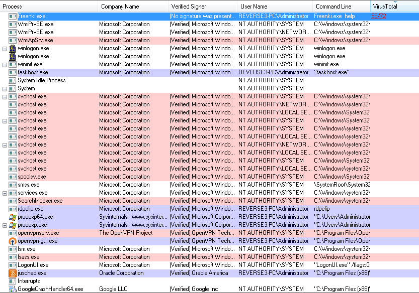
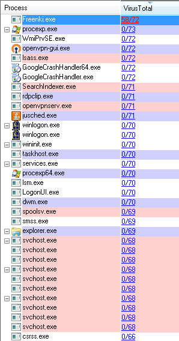
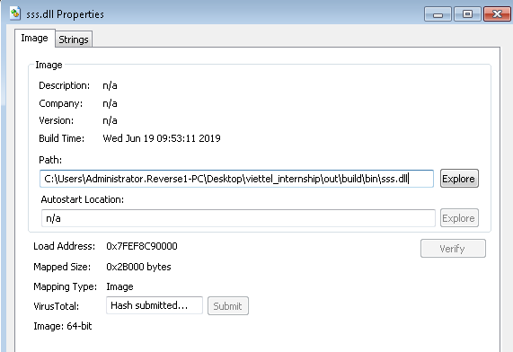
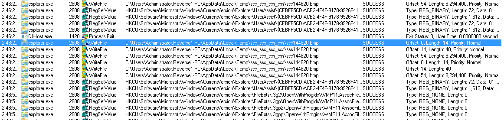
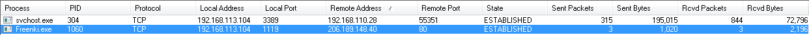

# Week 8: Using Forensic tools
> Author: Nguyen Anh Khoa
>
> Instructor: Dang Dinh Phuong

Update 1: 29 July 2019, add PCHunter and PowerTool. I tried to run a demo of HideToolZ but to no avail, the driver cannot be loaded so it fail hiding the process.

---

In this last week of internship, I learned about using tools to inspect, find, and removing malware. The suit of programs mostly are from [SysInternal](https://docs.microsoft.com/en-us/sysinternals/), and can be downloaded online for free on [microsoft](https://docs.microsoft.com/en-us/sysinternals/downloads/).

## Process Explorer

> Find out what files, registry keys and other objects processes have open, which DLLs they have loaded, and more. This uniquely powerful utility will even show you who owns each process.

This program lists process running and updates every interval (1s, 5s, ...). Using this program, we can find processes running on our system, checking the verification of the process. If a process is not signed, it could be a warning. The interface is simple, we have processes listed as tree on the left, clicking on one of them will provide details in the box below. To the right of the process's name are information to that process. We can see the PID, Description, Verified Signer, User Name invoke the process, Command Line given to it when run, and network in out.

Right-clicking on a process will provide us many options like kill, restart, and suspend. We can create a dump of a process by using `Create Dump` option, which then ask for a minidump or a fulldump, these will come in handy when we need to inspect the process memory. We can `Debug` the process, which will open a windows for us to choose debugger, Visual Studio, or manually choose the debugging engines. And we can also check virus total for the file of the process. Process explorer will send the file hash to the server, if it is a known malware, the result will be like below.



We can see that Freenki.exe does not have a valid signature, and Virus Total check shows a 58/72 virus engines detecting the malware. If we click `Options -> VirusTotal.com -> Check VirusTotal.com` it will send all running process to VirusTotal. The result:



Now we know that Freenki.exe is a malware, we can kill it, or suspend it by right clicking on the process, and choose Kill Process/Suspend.

If somehow the malware is not a process, but a dll injected to the process, or more stealth, a thread injected and run inside a process? Using the old malware that inject the dll in Explorer I created in week 3 exercise. sss.dll is listed in the dll section, there is no Company Name, no signature, and VirusTotal check shows `Unknown`. This dll looks suspicious. If this is a injected dll, we can find the find by right clicking on the dll file, a choose properties. The path to the dll can be found. We can check the thread of the host application `Explorer.exe`. At this time, we can kill the running thread, however we have not unload the dll. Process Explorer cannot unload the library, so restarting the process will clear these library. Supposed we know the dll name, we can search for opening `Handle` by `Ctrl+F` and type in the search box. With sss as our dll name, we also find the `file Handle` and close the handle.




## Process Monitor

Now after we have found the malware, we may not want to kill it instantly but want monitor the internet traffic, files read write, registry read write. We will open Process monitor. By default, process monitor will list everything, but we can change the filter. So this application works best only if we know, or suspect, some processes is doing bad behavior.



If we filter only WriteFile


## TCP View

Process monitor is good for events and stuff, but everything together is a mess. We can use TCP View to simplify the internet connection. TCPView has two options, `address resolve` and `show unconnected endpoint`. If our malware is connecting outside, we can turn off `unconnected endpoint` to see only connecting ones. And turn off `address resolve` to find the ip address. And yes we can end the process, or close the internet handle. After we have identify the connection, we can use other tools (Wireshark) to inspect the request. This application works best if there is no other network, or we can filter out clean processes.



## Autoruns

When we hunt a malware, we should definitely look out for autoruns. Autoruns are executable that will run on system log on. Like our `Freenki.exe` inject it self as a key to run automatically after a user logs on. With autoruns, we can inspect those registry keys, folders that contains autoruns application.


After `Freenki.exe` injection:


Again we can check virus total. Autoruns `Options -> Hide VirusToal Clean Entries` is a big help for us to whitelist others processes. We can enable this by enable VirusTotal for every file. After that, rescan and we can focus more on the suspicious file.


And deleting the entry file can't be more simpler.

## QrCode

This is a application for a no internet connection machine. Sometimes machine comes with no outside internet to prevent infiltration or secret data stealing. If this is the case, the VirusTotal check is unable. But we can still, hash the file and send to VirusTotal, using this application, we can hash the file by dropping to the window. The application will draw a QrCode, which opens a link to VirusTotal check.


The result above will resolve to: [https://www.virustotal.com/#/file/7f35521cdbaa4e86143656ff9c52cef8d1e5e5f8245860c205364138f82c54df](https://www.virustotal.com/#/file/7f35521cdbaa4e86143656ff9c52cef8d1e5e5f8245860c205364138f82c54df).

```python
from pyzbar.pyzbar import decode
from PIL import Image

print(decode(Image.open('qrcode.png')))

# [Decoded(data=b'https://www.virustotal.com/#/file/7f35521cdbaa4e86143656ff9c52cef8d1e5e5f8245860c205364138f82c54df', type='QRCODE', rect=Rect(left=1008, top=266, width=354, height=315), polygon=[Point(x=1008, y=266), Point(x=1008, y=580), Point(x=1362, y=581), Point(x=1362, y=266)])]
```

## PCHunter

This is a program that is commonly used to detect applications, processes in kernel level. It was first named xuetr, but later renamed to PCHunter. The current program is still being updated and avaible on their [website](http://www.xuetr.com/download/). Upon opening the program, we see a list of process. Different to aforementioned programs, PCHunter has a `EPROCESS` field. In short, `EPROCESS` is a process representation, like PEB, in the Kernel Mode, the struct is [here](https://www.nirsoft.net/kernel_struct/vista/EPROCESS.html).

Right click on one process, and choose `Find Unsigned Module`, the program will open and search for unsigned modules. In the screenshot below, we can see that our `sss.dll` and `Freenki.exe` are both listed with their EPROCESS addresses.


We can inspect Ring0 Hooks, and Ring3 Hooks. In Ring3 Hook, we can see our `sss.dll` is hooking `WH_KEYBOARD_LL`, we can right click and disable hooking.


PCHunter also has Network inspection, and Registry file tree, Startup Info. In Startup Info, we can right click and choose to `Verify All Startup Signature`. After, we can right click and choose to delete `startup` or `startup and file` of any startup entry.


PCHunter is a kernel mode analysis tool, we can kill, force kill, unload any process/library. Which is why it could cause harm to the system. This tool should be used with care, and before using the tool on a client machine, ask for permission first.


## PowerTool

I cannot find a trusted source for PowerTool, but someone posted the files on [github/repoool/powertool](https://github.com/repoool/powertool). PowerTool is a kernel mode analysis tool like PCHunter, the interface is quite alike to previous programs. We can inspect processes, processes' modules, processes' threads, application message hook, kernel hook, startup entries, and network activities. We can also stop threads, and unhook. This program can also verify all processes' signature and scan file upload to virus total.


And again, we should take into consideration using these tools as it could cause harm to the client machine.

## Summary

The above are some tools that malware analysis frequently use to monitor the computer and look for bad files. These tools are simple, easy to use, but a good user is a user with experience. One must know what bad files do to detect them quickly and counter them with ease. After the malware sample is taken, the next step is to remove it, safely, and learn about it by reversing.
